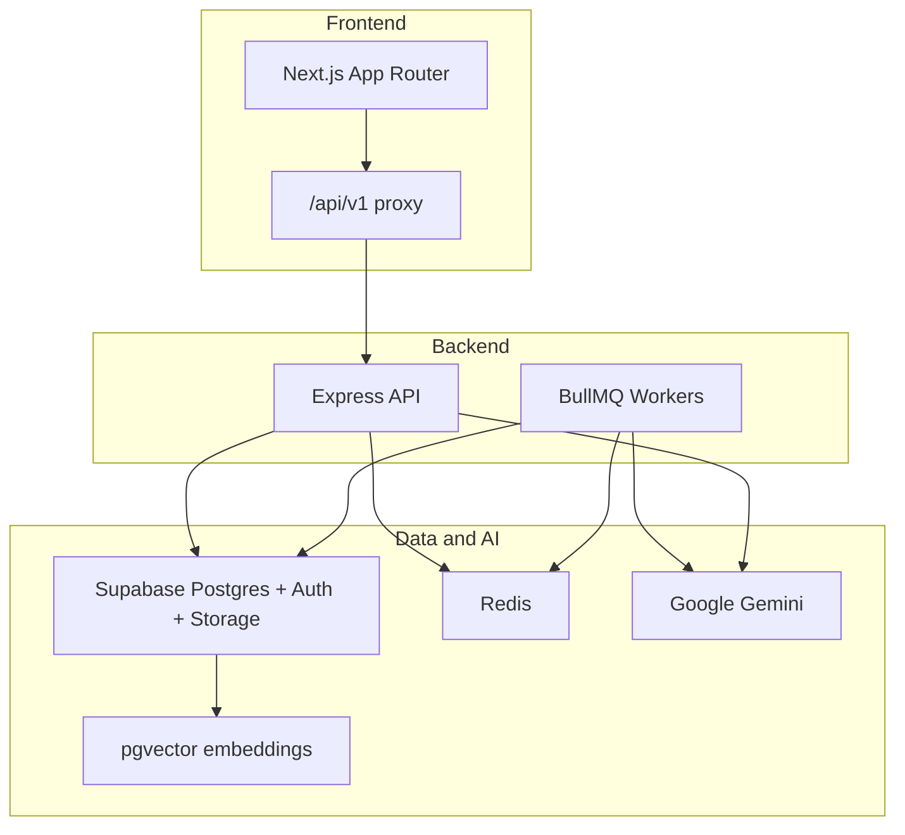

# Vital Health

**Your personal health records platform with an AI advocate built in.**

Upload lab reports and medical documents once. Vital classifies them, extracts structured data, and indexes everything for search. Ask questions in plain language—from the search bar or the **AI Advocate** chat—and get answers grounded in your own records with source citations. Track biomarkers over time, share safely with family, and generate personalized nutrition and fitness plans.

Next.js 16 · React 19 · TypeScript · Supabase · Google Gemini · BullMQ

---

## Capabilities at a glance

| Area | What Vital does |
|------|-----------------|
| **Health records** | Upload PDFs and images; private storage; searchable document library |
| **Document AI** | Auto-classify 9 document types; extract labs, prescriptions, bills, and EOBs |
| **Semantic search** | Find content across all records using pgvector embeddings |
| **AI Advocate** | RAG-powered chat with streaming replies and document citations |
| **Lab trends** | Biomarker dashboard, trend charts, reference ranges, alerts, and AI insights |
| **Family network** | Care circles, invitations, caregiver summaries, and emergency briefs |
| **Wellness** | Nutrition targets, 4-week AI fitness plans, 7-day meal menus, weekly check-ins |
| **Security** | Row Level Security, private storage, HttpOnly sessions, chat emergency guardrails |

---

## Architecture



**Request flow:** The Next.js app proxies API calls to Express. Document uploads enqueue background jobs that classify and extract with Gemini, chunk and embed text into pgvector, and run biomarker trend analysis. Chat and wellness features call Gemini on demand with structured JSON schemas.

### Background workers

| Worker | Responsibility |
|--------|----------------|
| Document | Download file → classify type → extract structured fields → persist to PostgreSQL |
| Embedding | Chunk document text → generate embeddings → store vectors for semantic search |
| Trend | Analyze biomarker changes → create alerts → notify family members when configured |

---

## Tech stack

| Layer | Technologies |
|-------|--------------|
| Frontend | Next.js 16, React 19, Tailwind CSS v4, shadcn/ui, TanStack Query, Recharts, Zustand |
| Backend | Express 5, TypeScript, Zod, BullMQ, Multer |
| Database & auth | Supabase (PostgreSQL, Auth, Storage, pgvector) |
| Queues & cache | Redis + BullMQ |
| AI | Google Gemini — classification, extraction, embeddings, chat, lab insights, wellness plans |

---

## Features

### Authentication & health profile

- Email registration and login with secure HttpOnly cookie sessions
- Onboarding wizard for date of birth, biological sex, and baseline health details
- Profile stores conditions, allergies, medications, and emergency contacts

### Health records & document intelligence

- Upload PDF, JPEG, and PNG files to a private Supabase Storage bucket
- Automatic classification into lab reports, prescriptions, discharge summaries, imaging reports, medical bills, insurance EOBs, policies, vaccination records, and more
- Structured extraction per document type—biomarkers from labs, line items from bills, medication details from prescriptions
- Document detail views with processing status, extracted data, and signed download URLs

### Semantic search & AI Advocate

- Vector search over document chunks with configurable similarity thresholds
- **AI Advocate** chat with streaming responses, conversation history, and hybrid retrieval (embeddings + structured facts from labs and profile)
- Query expansion for better recall on natural-language questions
- Source citations linking answers back to specific records
- Emergency guardrails redirect urgent symptoms to seek immediate care

### Lab trends & biomarkers

- Dashboard of tracked biomarkers with status (normal, borderline, concerning, critical) and trend direction
- Per-biomarker detail pages with history charts and AI-generated insights
- Reference range catalog with sex- and age-adjusted thresholds
- Manual reading entry and automated alerts on significant changes
- Family notification when biomarker status shifts for shared members

### Family health network

- Create care circles and invite members by email
- Permission tiers: full access, monitor (read-only summary), or emergency-only
- Caregiver summary with recent labs, alerts, and prescriptions
- Emergency health brief with profile, medications, and contacts
- In-app notifications for invitations, document processing, and biomarker alerts

### Fitness & wellness planning

- Wellness preferences wizard: diet, region/cuisine, activity level, work routine, fitness goal, target weight, sleep
- Computed nutrition targets (BMR, TDEE, macros) with lab-based adjustments
- AI-generated 4-week plans with activity targets, dietary guidance, 7-day meal menus, and sleep goals
- Weight tracking with trend charts and weekly check-ins with coach feedback

---

## Project structure

```
vital-health/
├── frontend/          # Next.js app (port 3000)
├── backend/           # Express API + background workers (port 3001)
├── supabase/          # Database migrations and local Supabase config
└── docker-compose.yml # Redis for job queues
```

---

## Getting started

### Prerequisites

- Node.js 20+
- [Docker Desktop](https://www.docker.com/products/docker-desktop/)
- [Supabase CLI](https://supabase.com/docs/guides/cli)
- [Google Gemini API key](https://aistudio.google.com/apikey)

### 1. Clone and install

```bash
git clone https://github.com/your-username/vital-health.git
cd vital-health

cd backend && npm install
cd ../frontend && npm install
```

### 2. Start local infrastructure

From the repo root:

```bash
supabase start
supabase db push --local
docker compose up -d
```

Verify services:

```bash
supabase status                    # copy URL and keys into .env files
docker exec -it redis redis-cli ping   # → PONG
```

### 3. Configure environment

Copy example env files and fill in values from `supabase status` and your Gemini API key:

```bash
cp backend/.env.example backend/.env
cp frontend/.env.example frontend/.env.local
```

### 4. Run the application

Use three terminals for the full stack:

```bash
# Terminal 1 — API server
cd backend && npm run dev

# Terminal 2 — background workers (required for document processing)
cd backend && npm run worker

# Terminal 3 — frontend
cd frontend && npm run dev
```

Open [http://localhost:3000](http://localhost:3000)

Health check:

```bash
curl http://localhost:3001/api/v1/health
```

### 5. Quick walkthrough

1. Register and complete onboarding
2. **Records** → upload a lab report PDF (keep the worker running)
3. Open the document to view extracted biomarkers
4. Search for `glucose` or `blood sugar` from the header or Records page
5. **AI Advocate** → ask about your labs; answers stream in with citations
6. **Lab Trends** → explore biomarker charts and insights
7. **Fitness** → complete wellness setup and generate a personalized plan
8. **Family** → create a care circle and invite a member

To index documents uploaded before search was enabled:

```bash
cd backend && npm run backfill:embeddings
```

### Troubleshooting

| Issue | Fix |
|-------|-----|
| `ECONNREFUSED` on port 6379 | Start Redis: `docker compose up -d` |
| Document stuck on "processing" | Ensure `npm run worker` is running in `backend/` |
| Chat or search returns nothing | Run `npm run backfill:embeddings` for older uploads |

---

## API overview

Base path: **`/api/v1`** (proxied through the Next.js app at `/api/v1/*`)

| Group | Prefix | Purpose |
|-------|--------|---------|
| Health | `/health` | Service and database connectivity |
| Auth | `/auth` | Register, login, logout, session |
| Profile | `/profile` | User health profile |
| Documents | `/documents` | Upload, list, search, view, update, delete |
| Chat | `/chat` | Conversation sessions and streaming messages |
| Lab | `/lab` | Biomarkers, readings, insights, alerts |
| Family | `/family` | Groups, invitations, caregiver views, notifications |
| Wellness | `/wellness` | Preferences, nutrition targets, plans, check-ins, weight |

Route definitions live in [`backend/src/routes/`](backend/src/routes/).

---

## Data model

Vital stores data in Supabase PostgreSQL with Row Level Security on user-owned tables.

| Domain | Key entities |
|--------|--------------|
| Identity | Profiles linked to Supabase Auth users |
| Records | Documents, extracted fields (labs, prescriptions, bills, EOBs), vector chunks |
| Lab | Biomarker readings, reference ranges, alerts |
| Chat | Conversations and messages |
| Family | Groups, memberships, invitations, notifications |
| Wellness | Preferences, weight measurements, plans, weekly check-ins |

Document chunks are embedded with Gemini and stored in **pgvector** for cosine-similarity search via a PostgreSQL RPC function.

---

## Development scripts

### Frontend (`frontend/`)

| Command | Description |
|---------|-------------|
| `npm run dev` | Development server |
| `npm run build` | Production build |
| `npm run lint` | ESLint |

### Backend (`backend/`)

| Command | Description |
|---------|-------------|
| `npm run dev` | API server with hot reload |
| `npm run worker` | Document, embedding, and trend workers |
| `npm run build` | Compile TypeScript to `dist/` |
| `npm run start` | Run compiled production server |
| `npm run test` | Full integration test suite |
| `npm run test:gemini` | Gemini connectivity and JSON parsing |
| `npm run test:processing` | Upload → extract → database pipeline |
| `npm run test:embeddings` | Chunking, embedding, and search |
| `npm run test:chat` | RAG chat pipeline |
| `npm run test:lab` | Trend analysis and lab endpoints |
| `npm run test:family` | Family network flows |
| `npm run test:nutrition` | Nutrition calculator |
| `npm run test:wellness` | Wellness validation schemas |
| `npm run backfill:embeddings` | Index documents missing embeddings |

### Infrastructure

| Command | Description |
|---------|-------------|
| `supabase start` / `supabase stop` | Local Supabase stack |
| `supabase db push --local` | Apply migrations |
| `supabase db reset` | Reset local database |
| `docker compose up -d` | Start Redis |
| `docker compose down` | Stop Redis |

---

## Security & privacy

- **Private storage** — Health documents live in a non-public Supabase bucket; access via signed URLs
- **Row Level Security** — Database policies restrict each user to their own data
- **Session cookies** — HttpOnly cookies for auth tokens; no tokens in localStorage
- **AI disclaimer** — The Advocate and insights summarize your records; they do not replace professional medical advice
